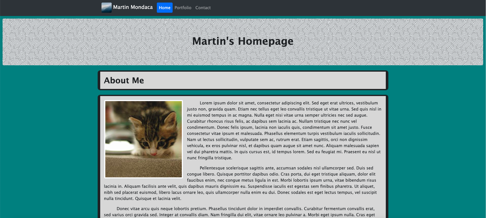
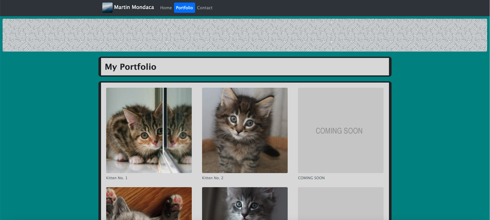
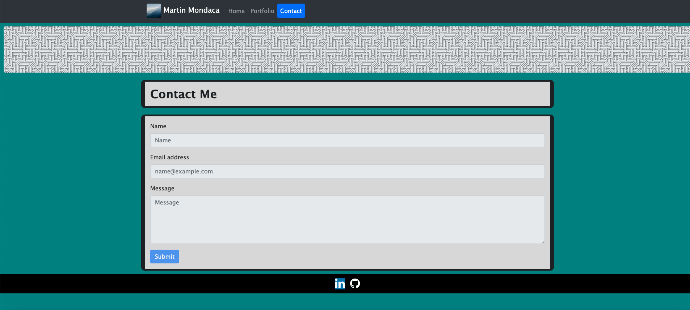
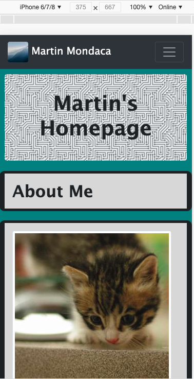
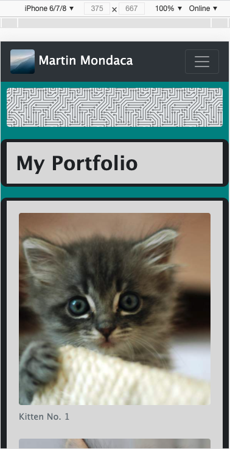
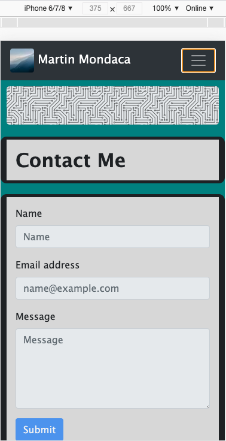

# Martin Mondaca's Portfolio

## Description

The motivation for this project was the desire to create a webpage or set of webpages that use the **[Bootstrap](https://getbootstrap.com/)** toolkit and its responsive grid system. The reason for building this project was to create a portfolio website for myself. This portfolio website contains a bio section, a portfolio section showcasing completed web devolpment projects, and a contact section where I may be reached. Please note that at this time the bio and portfolio sections contain placeholder text and images, and the contact page is disabled; this information will be updated periodically in the near future.

Using the Bootstrap toolkit solves the issue of having to use too many media queries, and also saves a lot of time when it comes to creating common website items such as a navigation bar and footer.

In the process of completing this project I was able to inscrease my knowledge of the Bootstrap framework. More specifically, in using the various components offered and combining those components. I was also able to better understand why it's so important to create a responsive website with a mobile-first approach; it's so important because you want a website that is accessible regardless of the user's device. Additionally, I gained a better understaning of the Bootstrap grid system and how to combine/nest containers, rows, and columns in order to achieve the desired layout.

## Desktop Webpage Images

## Mobile Webpage Images

## Deployed Link

https://martinmondaca.github.io/martin_mondaca_portfolio/

## License

Licensed under [MIT](https://choosealicense.com/licenses/mit/) license.
